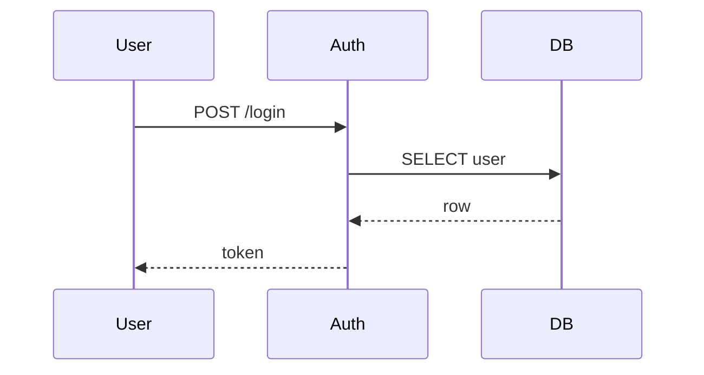

## Decision tree

```
                     content shape?
                          │
        ┌─────────────────┼─────────────────┐
   architecture        sequence /          chart
   ≥5 nodes            state machine       (numeric)
        │                  │                  │
        ▼                  ▼                  ▼
   excalidraw-mcp     mermaid-mcp       inline ASCII
   (browser preview)  (PNG / preview)   (block chars)
```

## Routing rules

| User says | Tool | Why |
|-----------|------|-----|
| "draw this", "render this", "show me visually" | shape detector → pick best | default |
| "as excalidraw", "in excalidraw" | `mcp__excalidraw__*` | user explicit |
| "as mermaid", "render mermaid", "make a mermaid" | `mcp__mermaid__mermaid_preview` | user explicit |
| "save as png", "export the diagram" | `mcp__mermaid__mermaid_save` | persistent output |
| "small diagram", "inline" | stay in ASCII (`┌─┐│└┘`) | override the routing |

## When to escalate ASCII → MCP

| Threshold | Reason |
|-----------|--------|
| ≥5 nodes in a flow | ASCII boxes get cramped at terminal width |
| ≥4 actors in a sequence | inline ASCII sequence becomes unreadable |
| ≥3 levels of decision branches | tree exceeds ~12 lines tall |
| User mentions "complex", "big", "overview" | implicit ask for richer rendering |
| Output going into PR description / wiki | export as PNG via mermaid-save |

## Output format

```
Glyph ASCII (small):              Glyph + MCP (big):
─────────────────                 ──────────────────
[full ASCII diagram inline]       → Rendering as excalidraw...
                                  → Open browser preview at <url>
                                  → Saved to /tmp/glyph-<hash>.png
                                  
                                  [one-line summary of what was drawn]
```

Always emit one line of context after MCP call so chat history stays useful even when the visual is in another window.

## Composing with mermaid for sequence diagrams

When user asks for a sequence diagram, prefer mermaid syntax → MCP preview:

````

````

Then call `mcp__mermaid__mermaid_preview` with the markdown block. User sees rendered SVG in browser.

## Composing with excalidraw for architecture

When user asks for system design, emit excalidraw JSON via the MCP. Excalidraw renders:
- vector boxes with custom labels
- arrows with text
- groups + colors
- pan/zoom interactivity

Use this for:
- System architecture (services, data stores, queues)
- Network topology
- Data flow across systems
- Anything that needs to be exported to a PR / Slack / doc

## Boundaries

- Don't call MCP for content that fits cleanly in 80x20 ASCII. Inline ASCII is faster and stays in chat history.
- Don't call MCP for code structure (use directory tree).
- Don't call MCP for tables (markdown tables already render natively in CC).
- If MCP isn't installed (no `mcp__excalidraw__*` or `mcp__mermaid__*` tools available), fall back to inline ASCII + tell user the MCP install command.

## Fallback when MCPs aren't installed

If no excalidraw / mermaid MCP detected:

```
→ MCP not detected for richer rendering. Falling back to ASCII.
→ Install for full power:
    excalidraw:  claude mcp add --transport http excalidraw https://mcp.excalidraw.com
    mermaid:     claude mcp add mermaid -- npx -y claude-mermaid
```

Then emit ASCII version anyway. Don't block the user.
